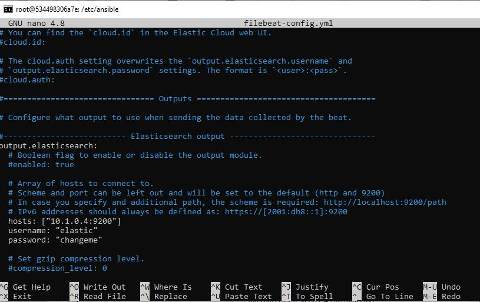
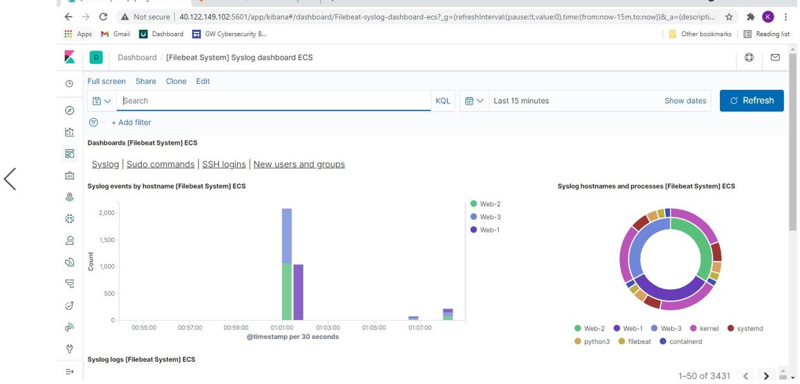
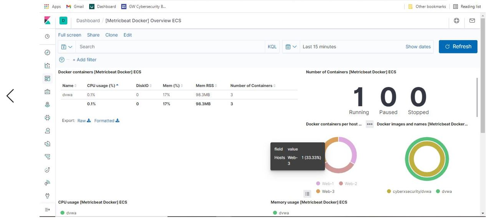

## Automated ELK Stack Deployment

The files in this repository were used to configure the network depicted below: 

 

These files have been tested and used to generate a live ELK deployment on Azure. They can be used to either recreate the entire deployment pictured above. Alternatively, select portions of the Filebeat-Install.yml file may be used to install only certain pieces of it, such as Filebeat.

  https://github.com/KevinPlatko/Scripts/tree/main/Ansible

This document contains the following details:
- Description of the Topology
- Access Policies
- ELK Configuration
  - Beats in Use
  - Machines Being Monitored
- How to Use the Ansible Build

### Description of the Topology

The main purpose of this network is to expose a load-balanced and monitored instance of DVWA, the D*mn Vulnerable Web Application.

Load balancing ensures that the application will be highly available, in addition to restricting access to the network.

⦁	Load balancers help protect the availability of resources. They also help distribute traffic evenly among servers and mitigate against Denial of Service (DoS) attacks. 

⦁	A jump box segregates between one private network or group of servers and external traffic. A jump box will create a single point of entry to that network or group of servers. A connection to a jump box occurs through SSH or RDP. Therefore, the jump box IP address will be public and will allow you to remove public IP addresses from devices behind the jump box. 

Integrating an ELK server allows users to easily monitor the vulnerable VMs for changes to the log files and system resources.

- Filebeat monitors the log files or locations of specified locations (such as specified servers), collects the log events and forwards them to Elasticsearch or logstash, which can later be visualized in Kibana. 

- Metricbeat collects metrics on the specified device or server such as downtime, CPU and memory. 
The configuration details of each machine may be found below.

| Name     | Function | IP Address | Operating System |
|----------|----------|------------|------------------|
| Jump Box | Gateway  | 10.0.0.4-Private; 20.85.243.139-Public  | Linux-Ubuntu            |
| Web-1    | Web Server          |10.0.0.8            |  Linux-Ubuntu                |
| Web-2    | Web Server          |10.0.0.7            |  Linux-Ubuntu                |
| Web-3    | Web Server         | 10.0.0.9           |   Linux-Ubuntu            |
| ELK      | ElasticSearch Stack| 10.1.0.4-Private; 40.122.149.102-Public | Linux-Ubuntu 

### Access Policies

The machines on the internal network are not exposed to the public Internet. 

Only the jump box machine can accept connections from the Internet. Access to this machine is only allowed from the following IP addresses:

- 71.191.64.120

Machines within the network can only be accessed by the jump box.
- The only machine that can access the ELK VM is the Jump Box
- Jump Box Private IP: 10.0.0.4
- Jump Box Public IP: 20.85.243.139

A summary of the access policies in place can be found in the table below.

| Name     | Publicly Accessible | Allowed IP Addresses |
|----------|---------------------|----------------------|
| Jump Box | Yes; SSH-Port 22             | 71.91.64.120   |
| Web 1,2,3         | No                    |  Web Load Balancer 40.122.149.102                    |
| Web Load Balancer(LB)         |  Yes-Port 80 HTTP                   | *                     |
| ELK                    | Yes-Port 5601-Kibana   | 71.91.64.120          |
 
### Elk Configuration

Ansible was used to automate configuration of the ELK machine. No configuration was performed manually, which is advantageous because this reduces human error and allows you to automate an entire system or machine all at once. 

The playbook implements the following tasks:
- Install Docker.io; the docker engine 
- Install pip3; python3-pip, the package used to install python software. 
- Install Docker Python Module; Python client for docker which is required by ansible to control state of containers. 
- Download and launch docker elk container; download the docker container sebp/el:761; with sebp being the organization that made the container, elk is the container and 761 is the version

The following screenshot displays the result of running `docker ps` after successfully configuring the ELK instance.

 

### Target Machines & Beats
This ELK server is configured to monitor the following machines:
- 10.0.0.9
- 10.0.0.7
- 10.0.0.8

We have installed the following Beats on these machines:
- Filebeat and Metricbeat were the two beats installed and they were installed successfully on Web-1, Web-2 and Web-3. 

These Beats allow us to collect the following information from each machine:
- Filebeat ships or forwards log data. It monitors log files and collects log events, for example login information and attempts. 
- Metricbeat is a light weight shipper that collects metrics from the operating system and any services running on that operating system. For example, CPU usage. 

### Using the Playbook
In order to use the playbook, you will need to have an Ansible control node already configured. Assuming you have such a control node provisioned: 

SSH into the control node and follow the steps below:
- Copy the Elk-Install.yml  file to /etc/ansible/roles/elk_install.yml
- Source: https://github.com/KevinPlatko/Scripts/blob/main/Ansible/Elk-Install.yml
- Update the hosts file to include the specified destination IP address of ELK server, under its proper host name. It should be written exactly as it is in the screenshot below :

 
- Run the playbook with ansible-playbook elk_install.yml and navigate to http;//{your_elk_server_ip]:5601 to check that the installation worked as expected. 
- You should see a webpage similar to this: 

### Installing Filebeat 

- To install filebeat, download the Filebeat-Install.yml file  to /ect/ansilbe/roles/filebeat-install.yml 
Source: https://github.com/KevinPlatko/Scripts/blob/main/Ansible/Filebeat-Install.yml
- Download the Filebeat-Config file https://github.com/KevinPlatko/Scripts/blob/main/Ansible/Filebeat-Config.yml
- Update the filebeat configuration file to and place the IP address to the ELK server  under the output.elasticsearch file. 

 

- Also, add your IP address under the setup.kibana section 

 

- Run the play with the command ansible-playbook Filebeat-Install.yml 

- Upon loading the data in Kibana, you should then see a webpage similar to this: 

### Installing Metricbeat 

- Install by downloading the Metricbeat-install.yml file, https://github.com/KevinPlatko/Scripts/blob/main/Ansible/Metricbeat-install.yml
- Download the Metricbeat-Config.yml file from https://github.com/KevinPlatko/Scripts/blob/main/Ansible/Metricbeat-config.yml
- Edit the Metricbeat-cofig.yml file adding the IP address of the ELK server under setup.kibana and the output.elasticserch sections. 

 
 
- Run the play with ansible-playbook Metricbeat-install.yml 

- Upon loading the data in Kibana, you should see a webpage similar to this: 
 

